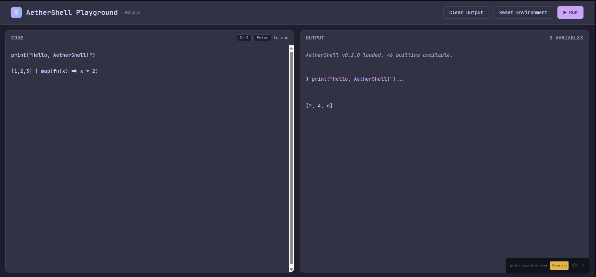

<p align="center">
  
</p>

<h1 align="center">Æther Shell (ae)</h1>

<p align="center">
  <a href="https://crates.io/crates/aethershell"></a>
  <a href="https://github.com/nervosys/AetherShell/actions/workflows/ci.yml"></a>
  <a href="https://github.com/nervosys/AetherShell/actions"></a>
  <a href="https://github.com/nervosys/AetherShell/blob/master/LICENSE"></a>
  <a href="https://github.com/nervosys/AetherShell/stargazers"></a>
</p>

<p align="center">
  <strong>The world's first agentic shell with typed functional pipelines and multi-modal AI.</strong><br>
  <em>Built in Rust for safety and performance, featuring revolutionary AI protocols found nowhere else.</em>
</p>

<p align="center">
  <a href="#-quick-start">Quick Start</a> •
  <a href="#-features">Features</a> •
  <a href="#-examples">Examples</a> •
  <a href="docs/TUI_GUIDE.md">TUI Guide</a> •
  <a href="#-documentation">Docs</a> •
  <a href="#-contributing">Contributing</a>
</p>

---

<p align="center">
  
</p>

---

## 🚀 Quick Start

### VS Code Extension (Syntax Highlighting + LSP)

For full IDE support including syntax highlighting, IntelliSense, and error diagnostics:

```bash
# Install the extension from marketplace
code --install-extension admercs.aethershell

# Build the Language Server (for IntelliSense)
cd AetherShell
cargo build -p aethershell-lsp --release

# The extension will auto-detect the LSP server
```

**Features:** Syntax highlighting, autocompletion, hover docs, go-to-definition, error diagnostics.

### Installation

**From Source (recommended for latest features):**
```bash
git clone https://github.com/nervosys/AetherShell && cd AetherShell
cargo install --path . --bin ae
```

**From Cargo:**
```bash
cargo install aethershell
```

**From Homebrew (macOS/Linux):**
```bash
brew tap nervosys/tap
brew install aethershell
```

**Usage:**
```bash
# Launch interactive TUI (recommended)
ae tui

# Or classic REPL
ae

# Run a script file
ae script.ae

# Evaluate inline expression
ae -c '1 + 2 * 3'

# JSON output mode
ae --json -c '[1, 2, 3] | map(fn(x) => x * 2)'
```

### Browser Playground

Try AetherShell directly in your browser with the WASM-powered playground:

<p align="center">
  
</p>

```bash
cd web
wasm-pack build --target web --out-dir pkg
npx serve .
# Open http://localhost:3000
```

The playground provides a full interactive shell with syntax highlighting and all builtins available.

```ae
# Type INFERENCE — types are automatically inferred
name = "AetherShell"                   # inferred as String
count = 42                             # inferred as Int
scores = [95, 87, 92, 88]              # inferred as Array<Int>

# Type ANNOTATIONS — explicit when needed for clarity
config: Record = {host: "localhost", port: 8080}
handler: fn(Int) -> Int = fn(x) => x * 2

# Typed pipelines — structured data, not text streams
[1, 2, 3, 4, 5] | map(fn(x) => x * 2) | sum()   # => 30

# Pattern matching
match type_of(count) {
    "Int" => "Integer: ${count}",
    "String" => "Text",
    _ => "Unknown"
}

# AI query with vision
ai("What's in this image?", {images: ["photo.jpg"]})

# Autonomous agent with tool access
agent("Find security issues in src/", ["ls", "cat", "grep"])

# Agent-to-Agent (A2A) protocol for multi-agent collaboration
a2a_send("analyzer", {task: "review code", files: ls("./src")})

# NANDA consensus for distributed agent decisions
nanda_propose("deployment", {version: "2.0", approve_threshold: 0.7})
```

> **📝 Note:** Set `OPENAI_API_KEY` for AI features: `export OPENAI_API_KEY="sk-..."`

---

## ✨ Features

<table>
<tr>
<td width="50%">

### 🤖 AI-Native Shell
- **Multi-modal AI**: Images, audio, video analysis
- **Autonomous agents** with tool access
- **MCP Protocol**: 130+ tools across 27 categories
- **A2A Protocol**: Agent-to-agent communication
- **A2UI Protocol**: Agent-to-user interface
- **NANDA**: Distributed consensus for agent networks
- **Multi-provider**: OpenAI, Ollama, local models
- **RAG & Knowledge Graphs** built-in

</td>
<td width="50%">

### 💎 Typed Pipelines
- **Hindley-Milner** type inference
- **Structured data**: Records, Arrays, Tables
- **First-class functions** and lambdas
- **Pattern matching** expressions

</td>
</tr>
<tr>
<td width="50%">

### 🧠 ML & Enterprise
- **Neural networks** creation & evolution
- **Reinforcement learning** (Q-Learning, DQN)
- **Enterprise RBAC** with role-based access
- **Audit logging** & compliance reporting
- **SSO integration** (SAML, OAuth, OIDC)
- **Cluster management** for distributed AI

</td>
<td width="50%">

### 🎨 Developer Experience
- **Interactive TUI** with tabs & themes
- **Language Server Protocol** (LSP)
- **VS Code extension** with IntelliSense
- **Plugin system** with TOML manifests
- **WASM support** for browser REPL
- **Package management** & imports

</td>
</tr>
</table>

---

## 🎯 What Makes AetherShell Unique?

AetherShell is the **only shell** combining these capabilities:

| Feature                             | AetherShell | Traditional Shells | Nushell |
| ----------------------------------- | :---------: | :----------------: | :-----: |
| AI Agents with Tools                |      ✅      |         ❌          |    ❌    |
| Multi-modal AI (Vision/Audio/Video) |      ✅      |         ❌          |    ❌    |
| MCP Protocol (130+ tools)           |      ✅      |         ❌          |    ❌    |
| A2A (Agent-to-Agent)                |      ✅      |         ❌          |    ❌    |
| A2UI (Agent-to-User Interface)      |      ✅      |         ❌          |    ❌    |
| NANDA Consensus Protocol            |      ✅      |         ❌          |    ❌    |
| Neural Networks Built-in            |      ✅      |         ❌          |    ❌    |
| Hindley-Milner Types                |      ✅      |         ❌          |    ✅    |
| Typed Pipelines                     |      ✅      |         ❌          |    ✅    |
| Enterprise (RBAC, Audit, SSO)       |      ✅      |         ❌          |    ❌    |
| Language Server Protocol (LSP)      |      ✅      |         ❌          |    ✅    |

### Bash vs AetherShell: A Quick Comparison

**Find large Rust files and show their sizes:**

```bash
# Bash: Text parsing, fragile, hard to read
find ./src -name "*.rs" -size +1k -exec ls -lh {} \; | awk '{print $9, $5}' | sort -k2 -h | tail -5
```

```ae
# AetherShell: Typed, composable, readable
ls("./src")
  | where(fn(f) => f.ext == ".rs" && f.size > 1024)
  | map(fn(f) => {name: f.name, size: f.size})
  | sort_by(fn(f) => f.size, "desc")
  | take(5)
```

**Analyze JSON API response:**

```bash
# Bash: Requires jq, string manipulation
curl -s https://api.github.com/repos/nervosys/AetherShell | jq '.stargazers_count, .forks_count'
```

```ae
# AetherShell: Native JSON, type-safe field access  
repo = http_get("https://api.github.com/repos/nervosys/AetherShell")
print("Stars: ${repo.stargazers_count}, Forks: ${repo.forks_count}")
```

**Ask AI to explain an error:**

```bash
# Bash: Not possible without external scripts
```

```ae
# AetherShell: Built-in AI with context
error_log = cat("error.log") | where(fn(l) => contains(l, "FATAL")) | first()
ai("Explain this error and suggest a fix:", {context: error_log})
```

---

## 📐 Language Features at a Glance

AetherShell is a **typed functional language** with 215+ built-in functions across these categories:

<table>
<tr>
<td width="33%">

### Types & Literals
- `Int` — `42`, `-7`
- `Float` — `3.14`, `2.0`
- `String` — `"hello"`, `"${var}"`
- `Bool` — `true`, `false`
- `Null` — `null`
- `Array` — `[1, 2, 3]`
- `Record` — `{a: 1, b: 2}`
- `Lambda` — `fn(x) => x * 2`

</td>
<td width="33%">

### Operators
- Arithmetic: `+` `-` `*` `/` `%` `**`
- Comparison: `==` `!=` `<` `<=` `>` `>=`
- Logical: `&&` `||` `!`
- Pipeline: `|`
- Member: `.`

</td>
<td width="33%">

### Control Flow
- `match` expressions
- Pattern guards
- Wildcard `_` patterns
- Lambda functions
- Pipeline chaining

</td>
</tr>
</table>

### Builtin Categories (215+ functions)

| Category         | Examples                                                    | Count |
| ---------------- | ----------------------------------------------------------- | ----- |
| **Core**         | `help`, `print`, `echo`, `type_of`, `len`                   | 15    |
| **Functional**   | `map`, `where`, `reduce`, `take`, `any`, `all`, `first`     | 12    |
| **String**       | `split`, `join`, `trim`, `upper`, `lower`, `replace`        | 10    |
| **Array**        | `flatten`, `reverse`, `slice`, `range`, `zip`, `push`       | 8     |
| **Math**         | `abs`, `min`, `max`, `sqrt`, `pow`, `floor`, `ceil`         | 8     |
| **Aggregate**    | `sum`, `avg`, `product`, `unique`, `values`, `keys`         | 6     |
| **File System**  | `ls`, `cat`, `pwd`, `cd`, `exists`, `mkdir`, `rm`           | 11    |
| **Config**       | `config`, `config_get`, `config_set`, `themes`              | 7     |
| **Debugging**    | `debug`, `dbg`, `trace`, `assert`, `type_assert`, `inspect` | 7     |
| **Async**        | `async`, `await`, futures support                           | 3     |
| **Errors**       | `try`/`catch`, `throw`, `is_error`                          | 4     |
| **AI**           | `ai`, `agent`, `swarm`, `rag_query`, `finetune_start`       | 20+   |
| **Enterprise**   | `role_create`, `audit_log`, `sso_init`, `compliance_check`  | 22    |
| **Distributed**  | `cluster_create`, `job_submit`, `aggregate_results`         | 15    |
| **Platform**     | `platform`, `is_windows`, `is_linux`, `features`            | 12    |
| **MCP Protocol** | `mcp_tools`, `mcp_call`, 130+ tool integrations             | 130+  |

---

## 📖 Examples

### Core Syntax — Type Inference & Annotations

AetherShell uses **Hindley-Milner type inference** with optional explicit annotations:

```ae
# TYPE INFERENCE — compiler infers types automatically
age = 42                        # inferred: Int
pi = 3.14159                    # inferred: Float
name = "AetherShell"            # inferred: String
active = true                   # inferred: Bool

# TYPE ANNOTATIONS — explicit when clarity is needed
config: Record = {host: "localhost", port: 8080, debug: true}
scores: Array<Int> = [95, 87, 92, 88]
matrix: Array<Array<Int>> = [[1, 2], [3, 4]]

# String interpolation (type inferred)
greeting = "Hello, ${name}! You're ${age} years old."

# Records — structured data with field access
user = {name: "Alice", age: 30, admin: true}  # inferred: Record
print(user.name)               # => "Alice"

# Lambdas — annotate for complex signatures
double = fn(x) => x * 2                        # inferred: fn(Int) -> Int
add: fn(Int, Int) -> Int = fn(a, b) => a + b   # explicit return type
greet = fn(s) => "Hi, ${s}!"                   # inferred: fn(String) -> String

print(double(21))              # => 42
print(add(10, 20))             # => 30
```

### Strong Types — Runtime Safety

```ae
# Type inspection (no annotation needed)
type_of(42)                    # => "Int"
type_of(3.14)                  # => "Float"
type_of("hello")               # => "String"
type_of([1, 2, 3])             # => "Array"
type_of({a: 1})                # => "Record"
type_of(fn(x) => x)            # => "Lambda"

# Type assertions for validation
type_assert(42, "Int")          # Passes
type_assert("hello", "String")  # Passes
type_assert([1,2,3], "Array")   # Passes

# Pattern matching on types (inference works here too)
process = fn(val) => match type_of(val) {
    "Int" => val * 2,
    "String" => upper(val),
    "Array" => len(val),
    _ => null
}

process(21)                    # => 42
process("hello")               # => "HELLO"
process([1,2,3,4,5])           # => 5
```

### Functional Pipelines — Structured Data, Not Text

Unlike traditional shells that pipe text, AetherShell pipes **typed values**:

```ae
# Transform: map applies a function to each element
numbers = [1, 2, 3, 4, 5]                          # inferred: Array<Int>
squared = numbers | map(fn(x) => x * x)            # => [1, 4, 9, 16, 25]

# Filter: where keeps elements matching a predicate
evens = numbers | where(fn(x) => x % 2 == 0)       # => [2, 4]

# Aggregate: reduce combines elements into one value
total = numbers | reduce(fn(acc, x) => acc + x, 0) # => 15

# Chain operations — type flows through the pipeline
result = [1, 2, 3, 4, 5, 6, 7, 8, 9, 10]
  | where(fn(x) => x % 2 == 0)     # [2, 4, 6, 8, 10]
  | map(fn(x) => x ** 2)           # [4, 16, 36, 64, 100]
  | reduce(fn(a, b) => a + b, 0)   # 220

# Array manipulation (types inferred)
reversed = [1, 2, 3, 4, 5] | reverse       # => [5, 4, 3, 2, 1]
flat = [[1, 2], [3, 4]] | flatten          # => [1, 2, 3, 4]
sliced = [1, 2, 3, 4, 5] | slice(1, 4)     # => [2, 3, 4]

# Predicate checks
has_large = [1, 2, 3, 4, 5] | any(fn(x) => x > 4)   # => true
all_even = [2, 4, 6, 8] | all(fn(x) => x % 2 == 0)  # => true
```

### Pattern Matching — Exhaustive Type-Safe Control Flow

```ae
# Match on values with range patterns (inference works)
grade = fn(score) => match score {
    100 => "Perfect!",
    90..99 => "A",
    80..89 => "B", 
    70..79 => "C",
    _ => "Keep trying"
}
grade(95)                      # => "A"
grade(100)                     # => "Perfect!"

# Match with guards for complex conditions
classify = fn(n) => match n {
    x if x < 0 => "negative",
    0 => "zero",
    x if x > 0 => "positive"
}
classify(-5)                   # => "negative"
classify(42)                   # => "positive"

# Type-based dispatch — annotate for polymorphic functions
describe: fn(Any) -> String = fn(val) => match type_of(val) {
    "Int" => "Integer: ${val}",
    "Float" => "Decimal: ${val}",
    "String" => "Text (${len(val)} chars): ${val}",
    "Array" => "Collection of ${len(val)} items",
    "Record" => "Object with keys: ${keys(val)}",
    _ => "Unknown type"
}

describe(42)                   # => "Integer: 42"
describe("hello")              # => "Text (5 chars): hello"
describe([1, 2, 3])            # => "Collection of 3 items"
describe({x: 1, y: 2})         # => "Object with keys: [x, y]"
```

### String Operations — Built-in Text Processing

```ae
# Manipulation
split("a,b,c", ",")            # => ["a", "b", "c"]
join(["a", "b", "c"], "-")     # => "a-b-c"
trim("  hello  ")              # => "hello"
upper("hello")                 # => "HELLO"
lower("WORLD")                 # => "world"
replace("foo bar foo", "foo", "baz")  # => "baz bar baz"

# Queries
contains("hello world", "world")      # => true
starts_with("hello", "hel")           # => true
ends_with("hello", "lo")              # => true
len("hello")                          # => 5
```

### Math Operations — Scientific Computing

```ae
# Basic math
abs(-42)                       # => 42
min(5, 3)                      # => 3
max(5, 3)                      # => 5
pow(2, 10)                     # => 1024
sqrt(16)                       # => 4.0

# Rounding
floor(3.7)                     # => 3
ceil(3.2)                      # => 4
round(3.5)                     # => 4

# Statistical (on arrays)
sum([1, 2, 3, 4, 5])           # => 15
avg([10, 20, 30])              # => 20
product([2, 3, 4])             # => 24
unique([1, 2, 2, 3, 3, 3])     # => [1, 2, 3]
```

### Error Handling — Try/Catch/Throw

```ae
# Safe operations with try/catch
result = try {
    risky_operation()
} catch {
    "default_value"
}

# Catch with error binding
result = try {
    parse_config("invalid.toml")
} catch e {
    print("Error: ${e}")
    default_config()
}

# Throw custom errors
validate = fn(x) => {
    if x < 0 {
        throw "Value must be non-negative"
    }
    x
}

# Check for errors
is_error(try { throw "oops" } catch e { e })  # => true
```

### Async/Await — Concurrent Operations

```ae
# Define async functions (type inferred from return)
fetch_data = async fn(url) => http_get(url)

# Await results
data = await fetch_data("https://api.example.com/data")

# Parallel operations with futures (types flow through)
urls = ["https://api1.com", "https://api2.com", "https://api3.com"]
futures = urls | map(fn(u) => async fn() => http_get(u))
results = futures | map(fn(f) => await f())

# When explicit types help readability:
timeout: Duration = 30s
response: Result<Record, Error> = await http_get_with_timeout(url, timeout)
```

### Debugging — Development Tools

```ae
# Debug prints value with type and returns it (for chaining)
[1, 2, 3] | debug() | map(fn(x) => x * 2)
# Prints: [Debug] Array<Int>: [1, 2, 3]
# Returns: [2, 4, 6]

# Trace with labels for pipeline debugging
[1, 2, 3, 4, 5]
  | trace("input")
  | where(fn(x) => x > 2) | trace("filtered")
  | map(fn(x) => x * 2) | trace("doubled")
# Prints each stage with labels

# Assertions for testing
assert(1 + 1 == 2)
assert(len("hello") == 5, "Length should be 5")

# Type assertions (explicit check)
type_assert(42, "Int")
type_assert([1, 2, 3], "Array")

# Deep inspection (inference works)
info = inspect([1, 2, 3])
# => {type: "Array", len: 3, values: [1, 2, 3]}
```

### File System — Structured Output

```ae
# List files with structured data (inference handles types)
files = ls("./src")
  | where(fn(f) => f.size > 1000)
  | map(fn(f) => {name: f.name, kb: f.size / 1024})
  | take(5)

# Read and process files
line_count = cat("config.toml") | split("\n") | len()

# Check existence (type inferred)
file_exists = exists("./src/main.rs")  # => true

# Get current directory
cwd = pwd()                    # => "/home/user/project"
```

### Configuration System — XDG-Compliant

```ae
# Get full configuration as Record
config()

# Get specific values with dot notation (types inferred)
theme = config_get("colors.theme")           # => "tokyo-night"
max_history = config_get("history.max_size") # => 10000

# Set values persistently
config_set("colors.theme", "dracula")
config_set("editor.tab_size", 4)

# Get all paths (XDG Base Directory compliant)
paths = config_path()
print(paths.config_file)       # ~/.config/aether/config.toml
print(paths.data_dir)          # ~/.local/share/aether

# List all 38 built-in themes
available_themes = themes() | take(8)
# => ["catppuccin", "dracula", "github-dark", "gruvbox",
#     "monokai", "nord", "one-dark", "tokyo-night"]
```

### AI Agents with Tool Access

```ae
# Simple agent with goal and tools
agent("Find all files larger than 1MB in src/", ["ls", "du"])

# Agent with full configuration
agent({
  goal: "Identify and fix code style violations",
  tools: ["ls", "cat", "grep", "git"],
  max_steps: 20,
  dry_run: true,       # Preview actions before executing
  model: "openai:gpt-4o"
})

# Multi-agent swarm for complex tasks
swarm({
  coordinator: "Orchestrate a full security audit",
  agents: [
    {role: "scanner", goal: "Find vulnerable dependencies"},
    {role: "reviewer", goal: "Check for SQL injection"},
    {role: "reporter", goal: "Generate findings report"}
  ],
  tools: ["ls", "cat", "grep", "cargo"]
})
```

### Hierarchical Agent Swarms — Complex Task Decomposition

```ae
# Coordinator agent spawns specialized subagents for a large codebase refactor
refactor_swarm = swarm_create({
  name: "codebase_modernizer",
  coordinator: {
    goal: "Modernize legacy codebase to async/await patterns",
    strategy: "divide_and_conquer",
    model: "openai:gpt-4o"
  }
})

# Coordinator analyzes scope and spawns specialized subagents dynamically
swarm_spawn(refactor_swarm, {
  role: "analyzer",
  goal: "Map all sync functions that could be async",
  tools: ["grep", "cat", "ast_parse"],
  on_complete: fn(results) => {
    # Spawn worker agents for each module discovered
    results.modules | map(fn(mod) => {
      swarm_spawn(refactor_swarm, {
        role: "refactorer",
        goal: "Convert ${mod.name} to async/await",
        tools: ["cat", "edit", "git"],
        context: mod,
        parent: "analyzer"
      })
    })
  }
})

# Monitor swarm progress in real-time
swarm_status(refactor_swarm)
# => {active: 5, completed: 12, pending: 3, failed: 0}

# Stream progress updates
swarm_watch(refactor_swarm, fn(event) => {
  match event.type {
    "spawn" => print("🚀 ${event.agent.role}: ${event.agent.goal}"),
    "progress" => print("⏳ ${event.agent.role}: ${event.progress}%"),
    "complete" => print("✅ ${event.agent.role} finished: ${event.summary}"),
    "error" => print("❌ ${event.agent.role} failed: ${event.error}")
  }
})

# Wait for full completion with timeout
final_result = swarm_await(refactor_swarm, {timeout: 30m})
print("Refactored ${final_result.files_changed} files across ${final_result.modules} modules")
```

### Long-Running Task Orchestration

```ae
# Complex ML pipeline with checkpoint/resume
ml_pipeline = swarm_create({
  name: "training_pipeline",
  persistence: "checkpoint",     # Auto-save progress
  resume_on_failure: true
})

# Phase 1: Data preparation (spawns subagents per data source)
swarm_spawn(ml_pipeline, {
  role: "data_coordinator",
  goal: "Prepare training data from multiple sources",
  on_start: fn() => {
    data_sources = ["s3://bucket/raw", "postgres://db/features", "local://cache"]
    data_sources | map(fn(src) => {
      swarm_spawn(ml_pipeline, {
        role: "data_worker",
        goal: "Extract and clean data from ${src}",
        tools: ["s3", "sql", "pandas"],
        context: {source: src},
        checkpoint_interval: 5m    # Save progress every 5 minutes
      })
    })
  }
})

# Phase 2: Model training (auto-spawns after Phase 1)
swarm_spawn(ml_pipeline, {
  role: "trainer",
  goal: "Train model on prepared data",
  depends_on: ["data_coordinator"],  # Wait for all data workers
  tools: ["pytorch", "tensorboard", "gpu"],
  resources: {gpu: 4, memory: "64GB"},
  max_runtime: 4h
})

# Phase 3: Evaluation & deployment
swarm_spawn(ml_pipeline, {
  role: "evaluator",
  goal: "Validate model and deploy if metrics pass",
  depends_on: ["trainer"],
  tools: ["pytest", "mlflow", "k8s"],
  on_complete: fn(metrics) => {
    if metrics.accuracy > 0.95 {
      swarm_spawn(ml_pipeline, {
        role: "deployer",
        goal: "Deploy model to production",
        tools: ["docker", "k8s", "istio"]
      })
    }
  }
})

# Start the pipeline
swarm_start(ml_pipeline)

# Check detailed status
status = swarm_status(ml_pipeline, {detailed: true})
status.agents | map(fn(a) => "${a.role}: ${a.status} (${a.progress}%)")
```

### Multi-Modal AI

```ae
# Analyze images
ai("What's in this screenshot?", {images: ["screenshot.png"]})

# Process audio
ai("Transcribe and summarize this meeting", {audio: ["meeting.mp3"]})

# Video analysis
ai("Extract the key steps from this tutorial", {video: ["tutorial.mp4"]})
```

### Typed Functional Pipelines

```ae
# File system operations return typed Records, not text
large_rust_files = ls("./src")
  | where(fn(f) => f.ext == ".rs" && f.size > 1000)
  | map(fn(f) => {name: f.name, kb: f.size / 1024})
  | sort_by(fn(f) => f.kb, "desc")
  | take(5)

# Statistical operations (types flow through)
scores = [85, 92, 78, 95, 88]
total = scores | sum()                  # => 438
average = scores | avg()                # => 87.6
unique_ids = [1, 2, 1, 3, 2] | unique() # => [1, 2, 3]
record_values = {a: 1, b: 2} | values() # => [1, 2]
```

### Agentic Protocols — MCP, A2A, A2UI, NANDA

AetherShell provides first-class support for modern agent communication protocols:

#### MCP (Model Context Protocol)

```ae
# 130+ tools across 27 categories
all_tools = mcp_tools()
print(len(all_tools))                    # => 130

# Filter by category
mcp_tools({category: "development"})     # git, cargo, npm, etc.
mcp_tools({category: "machinelearning"}) # ollama, tensorboard, etc.
mcp_tools({category: "kubernetes"})      # kubectl, helm, k9s, etc.

# Execute tools via MCP protocol
mcp_call("git", {command: "status"})
mcp_call("cargo", {command: "build --release"})

# Register custom MCP server
mcp_register("my-tools", {
    endpoint: "http://localhost:8080",
    capabilities: ["code-review", "test-gen"]
})
```

#### MCP Server Mode

AetherShell can expose its tools as an MCP server for other AI agents to use:

```bash
# Start MCP server with default settings
ae mcp serve

# With CORS enabled for browser access
ae mcp serve --cors

# Configure host, port, and safety level
ae mcp serve --host 0.0.0.0 --port 3001 --safety caution

# List available MCP tools
ae mcp tools
ae mcp tools --category development
```

**Available endpoints:**
- `POST /mcp/v1/initialize` - Initialize MCP session
- `GET /mcp/v1/tools` - List available tools
- `POST /mcp/v1/tools/:name/execute` - Execute a tool
- `GET /mcp/v1/resources` - List resources
- `GET /mcp/v1/prompts` - List prompts
- `GET /health` - Health check

#### Agent API Mode (AI Callable Interface)

AetherShell provides a dedicated API for AI agents to call directly without generating brittle multi-line code. **Supports 24+ AI platforms** with native function calling schemas.

**Supported AI Platforms:**
- **OpenAI/ChatGPT** - GPT-5, GPT-5-mini, GPT-4o, o3, o4-mini
- **Anthropic Claude** - Claude 4.5 Opus/Sonnet/Haiku, Claude 3.5 Sonnet
- **Google Gemini** - Gemini 2.5 Pro/Flash, Gemini 2.0 Flash Thinking
- **Meta Llama** - Llama 4 Maverick/Scout, Llama 3.3/3.2/3.1
- **Mistral AI** - Mistral Large 2501, Codestral 2501, Ministral
- **Cohere** - Command A, Command R+
- **xAI Grok** - Grok-3, Grok-3 Mini/Fast
- **DeepSeek** - DeepSeek-V3, DeepSeek-R1, Reasoner
- **AWS Bedrock** - All tool-capable models (incl. Claude 4.5)
- **Azure OpenAI** - All deployed models (incl. GPT-5)
- **Alibaba Qwen** - Qwen 3 (235B-4B), QwQ, QVQ
- **Moonshot Kimi** - Kimi K2, Moonshot V2 (128K context)
- **01.AI Yi** - Yi Lightning, Yi Coder, Yi Vision V2
- **Zhipu GLM** - GLM-5, GLM-4 AllTools, CodeGeex-4
- **Reka AI** - Reka Core/Flash/Edge 2025, Reka Vibe
- **AI21 Labs** - Jamba 2 Large/Mini (256K context)
- **Perplexity** - Sonar Pro, Deep Research, R1-1776
- **Together AI** - Llama 4, Qwen 3, Gemma 3
- **Groq** - Llama 4 Scout, QwQ-32B (ultra-fast LPU)
- **Fireworks AI** - Llama 4, Qwen 3, DeepSeek R1
- **Local Models** - Ollama, vLLM, HuggingFace TGI
- **Multi-Provider** - OpenRouter (routes to 50+ providers)

```bash
# Start the Agent API server
ae agent serve --cors

# Generate schema for your AI platform
ae agent schema -f openai > tools.json
ae agent schema -f claude > tools.json
ae agent schema -f gemini > tools.json
ae agent schema -f llama > tools.json
ae agent schema -f mistral > tools.json
ae agent schema -f cohere > tools.json
ae agent schema -f grok > tools.json
ae agent schema -f deepseek > tools.json
ae agent schema -f bedrock > tools.json
ae agent schema -f azure > tools.json
ae agent schema -f qwen > tools.json
ae agent schema -f kimi > tools.json        # Moonshot AI
ae agent schema -f yi > tools.json          # 01.AI
ae agent schema -f glm > tools.json         # Zhipu ChatGLM
ae agent schema -f reka > tools.json        # Reka AI
ae agent schema -f ai21 > tools.json        # AI21 Labs
ae agent schema -f perplexity > tools.json  # Perplexity
ae agent schema -f together > tools.json    # Together AI
ae agent schema -f groq > tools.json        # Groq (fast inference)
ae agent schema -f fireworks > tools.json   # Fireworks AI
ae agent schema -f ollama > tools.json
ae agent schema -f vllm > tools.json
ae agent schema -f huggingface > tools.json
ae agent schema -f openrouter > tools.json

# Execute a JSON request
ae agent execute '{"action":"call","builtin":"pwd","args":{}}'

# Interactive mode (read JSON from stdin, output JSON responses)
ae agent interactive
```

**Instead of generating error-prone code like:**
```ae
let files = ls(".")
files | where(fn(f) => f.size > 1000) | map(fn(f) => f.name)
```

**AI agents can use structured JSON:**
```json
{
  "action": "call",
  "builtin": "ls",
  "args": { "path": "." }
}
```

**Pipeline execution:**
```json
{
  "action": "pipeline",
  "input": [1, 2, 3, 4, 5],
  "steps": [
    {"builtin": "map", "args": {"field": "* 2"}},
    {"builtin": "sum", "args": {}}
  ]
}
```

**Agent API Endpoints:**
- `POST /api/v1/execute` - Execute any request (call, pipeline, eval)
- `POST /api/v1/call/:builtin` - Call a single builtin
- `POST /api/v1/pipeline` - Execute a pipeline
- `POST /api/v1/eval` - Evaluate raw AetherShell code
- `POST /api/v1/stream/execute` - Stream any request (SSE)
- `POST /api/v1/stream/pipeline` - Stream pipeline with progress (SSE)
- `POST /api/v1/stream/eval` - Stream code evaluation (SSE)
- `GET /api/v1/schema` - Get compact language ontology
- `GET /api/v1/schema/:format` - Get schema for AI platform
- `GET /api/v1/builtins` - List all builtins
- `GET /api/v1/builtins/:name` - Describe a specific builtin
- `GET /api/v1/types` - Get type information
- `GET /health` - Health check with supported platforms list

**Streaming (Server-Sent Events):**
```bash
# Stream a pipeline with progress updates
curl -N -X POST http://localhost:3002/api/v1/stream/pipeline \
  -H "Content-Type: application/json" \
  -d '{"steps": [{"builtin": "ls", "args": {"path": "."}}, {"eval": "take(5)"}]}'

# Events: start → progress (per step) → complete/error
```

**Integration Examples:**
- Python: `examples/integration/python_integration.py` (OpenAI, Anthropic, LangChain)
- TypeScript: `examples/integration/typescript_integration.ts` (OpenAI, Anthropic, Vercel AI)
- AetherShell: `examples/12_agent_api_integration.ae`

**Language Ontology:** The schema endpoint exposes AetherShell's complete type system, operators, syntax patterns, and all builtin functions in platform-native formats that AI agents can understand and use for intelligent code generation.

#### A2A (Agent-to-Agent Protocol)

```ae
# Direct agent communication
a2a_send("analyzer", {
    task: "Review this code for security issues",
    payload: code_snippet,
    priority: "high"
})

# Receive responses from other agents
response = a2a_receive("analyzer", {timeout: 30s})

# Broadcast to all agents in swarm
a2a_broadcast({
    type: "status_update",
    status: "phase_1_complete",
    results: analysis_results
})

# Subscribe to agent channels
a2a_subscribe("security-alerts", fn(msg) => {
    if msg.severity == "critical" {
        alert_user(msg.details)
    }
})
```

#### A2UI (Agent-to-User Interface)

```ae
# Rich notifications
a2ui_notify("Analysis Complete", {
    body: "Found 3 security issues",
    type: "warning",
    actions: ["View", "Dismiss"]
})

# Interactive prompts
choice = a2ui_prompt("Select deployment target:", {
    options: ["staging", "production", "canary"],
    default: "staging"
})

# Render structured data in TUI
a2ui_render({
    type: "table",
    title: "Scan Results",
    columns: ["File", "Issue", "Severity"],
    rows: scan_results
})

# Progress indicators
task_id = a2ui_progress("Processing files...", {total: 100})
a2ui_progress_update(task_id, 50)  # 50% complete
```

#### NANDA (Networked Agent Negotiation & Decision Architecture)

```ae
# Multi-agent consensus for critical decisions
proposal = nanda_propose({
    action: "deploy_to_production",
    rationale: "All tests pass, security scan clean",
    required_votes: 3
})

# Agents vote on proposals
nanda_vote(proposal.id, {
    decision: "approve",
    confidence: 0.95,
    conditions: ["monitoring_enabled"]
})

# Wait for consensus
result = nanda_consensus(proposal.id, {timeout: 60s})
if result.approved {
    deploy()
}

# Dispute resolution
nanda_escalate(proposal.id, {
    reason: "Conflicting requirements detected",
    evidence: conflict_log
})
```

### Neural Networks & Evolution

```ae
# Create a neural network with layer sizes
brain = nn_create("agent", [4, 8, 2])  # 4 inputs, 8 hidden, 2 outputs

# Evolutionary optimization
pop = population(100, {genome_size: 10})
evolved = evolve(pop, fitness_fn, {generations: 50})

# Reinforcement learning
learner = rl_agent("learner", 16, 4)
```

---

## 🌍 Real-World Use Cases

### DevOps: Log Analysis Pipeline

```ae
# Parse and analyze application logs
error_logs = cat("/var/log/app.log")
  | split("\n")
  | where(fn(line) => contains(line, "ERROR"))
  | map(fn(line) => {
      timestamp: line | slice(0, 19),
      level: "ERROR",
      message: line | slice(27, len(line))
    })
  | take(10)

# Count errors by hour
error_counts = error_logs
  | map(fn(e) => e.timestamp | slice(0, 13))  # Extract hour
  | unique()
  | map(fn(hour) => {
      hour: hour,
      count: error_logs | where(fn(e) => starts_with(e.timestamp, hour)) | len()
    })
```

### Data Science: CSV Processing

```ae
# Process CSV data with type-safe pipelines
raw_data = cat("sales.csv") | split("\n")
headers = raw_data | first()
rows = raw_data | slice(1, len(raw_data)) | map(fn(row) => split(row, ","))

# Parse into Records (type annotation for complex transformations)
sales: Array<Record> = rows | map(fn(r) => {
    date: r[0],
    product: r[1],
    quantity: r[2] + 0,    # Convert to Int
    price: r[3] + 0.0      # Convert to Float
})

# Statistical analysis
total_revenue = sales | map(fn(s) => s.quantity * s.price) | sum()
avg_order = sales | map(fn(s) => s.quantity) | avg()
top_products = sales
  | map(fn(s) => s.product)
  | unique()
  | take(5)

print("Total Revenue: $${total_revenue}")
print("Average Order Size: ${avg_order} units")
```

### Security: Automated Code Audit

```ae
# AI-powered security scan
agent({
  goal: "Find potential security vulnerabilities in the codebase",
  tools: ["grep", "cat", "ls"],
  max_steps: 20
})

# Search for hardcoded secrets
ls("./src") 
  | where(fn(f) => ends_with(f.name, ".rs"))
  | map(fn(f) => {file: f.name, content: cat(f.path)})
  | where(fn(f) => contains(f.content, "password") || contains(f.content, "secret"))
```

### System Administration: Disk Usage Report

```ae
# Generate disk usage report (types flow through pipeline)
ls("/home")
  | map(fn(d) => {
      name: d.name,
      size_mb: d.size / (1024 * 1024),
      files: len(ls(d.path))
    })
  | where(fn(d) => d.size_mb > 100)
  | map(fn(d) => "${d.name}: ${round(d.size_mb)}MB (${d.files} files)")
```

### AI-Assisted Development

```ae
# Generate documentation from code
code = cat("src/main.rs")
docs = ai("Generate comprehensive API documentation for this Rust code:", {
    context: code,
    model: "openai:gpt-4o"
})

# Intelligent code review
agent({
  goal: "Review the recent git changes and suggest improvements for:
         - Performance optimizations
         - Security issues  
         - Code style consistency",
  tools: ["git", "cat", "grep"],
  max_steps: 15
})

# Generate tests with context awareness
module_code = cat("src/utils.rs")
test_code = ai("Write comprehensive unit tests covering edge cases:", {
  context: module_code,
  model: "openai:gpt-4o"
})

# Explain complex code
complex_fn = cat("src/parser.rs") | slice(100, 200)
ai("Explain what this function does in simple terms:", {context: complex_fn})
```

### Infrastructure: Kubernetes Monitoring

```ae
# List pods with structured output (types flow through)
pods = mcp_call("kubectl", {command: "get pods -o json"})
  | map(fn(pod) => {
      name: pod.metadata.name,
      status: pod.status.phase,
      restarts: pod.status.containerStatuses[0].restartCount
    })
  | where(fn(p) => p.restarts > 0)
```

### Enterprise: RBAC & Compliance

```ae
# Create roles with typed permissions
permissions = [
    {resource: "reports", actions: ["read", "export"]},
    {resource: "dashboards", actions: ["read", "create"]}
]
role_create("data_analyst", permissions, "Data analytics team role")

# Grant roles to users
role_grant("user_123", "data_analyst")

# Check permissions before operations
can_export = check_permission("user_123", "reports", "export")
if can_export {
    audit_log("report_export", {user: "user_123", report: "Q4_sales"})
    # ... export the report
}

# Compliance reporting
compliance_result = compliance_check("GDPR")
report = compliance_report("SOC2", "json")
```

### AI: Fine-tuning & RAG

```ae
# Start model fine-tuning
finetune_start("gpt-4o-mini", "training_data.jsonl", {
    epochs: 3,
    learning_rate: 0.0001
})

# Check fine-tuning status
finetune_status("ft-abc123")

# Build knowledge base with RAG
rag_index("project_docs", ["README.md", "docs/*.md"])
rag_query("project_docs", "How do I configure themes?")

# Knowledge graphs
kg_add("AetherShell", "language", "Rust")
kg_relate("AetherShell", "has_feature", "typed_pipelines")
kg_query({entity: "AetherShell"})
```

### Distributed Computing

```ae
# Create a compute cluster
cluster_create("ml_cluster", {max_nodes: 10})

# Add worker nodes
cluster_add_node("ml_cluster", "worker_1", {capabilities: ["gpu", "ml"]})
cluster_add_node("ml_cluster", "worker_2", {capabilities: ["gpu", "ml"]})

# Submit distributed jobs
job_submit("ml_cluster", "train_model", {
    model: "neural_net",
    data: "training_set.csv"
})

# Monitor cluster status
cluster_status("ml_cluster")
```

### Interactive Data Exploration

```ae
# Explore JSON APIs (types inferred from response)
response = http_get("https://api.github.com/repos/nervosys/AetherShell")
print("Stars: ${response.stargazers_count}")
print("Forks: ${response.forks_count}")  
print("Language: ${response.language}")

# Transform API data
topics_upper = response.topics | map(fn(t) => upper(t)) | join(", ")

# Build a dashboard from multiple endpoints
repos = http_get("https://api.github.com/users/nervosys/repos")
stats = repos | map(fn(r) => {
    name: r.name,
    stars: r.stargazers_count,
    lang: r.language
}) | where(fn(r) => r.stars > 0) | sort_by(fn(r) => r.stars, "desc")
```

### Git Workflow Automation

```ae
# Get recent commits with structured data
commits = mcp_call("git", {command: "log --oneline -10"})
  | split("\n")
  | map(fn(line) => {
      hash: line | slice(0, 7),
      message: line | slice(8, len(line))
    })

# Find commits by pattern
bug_fixes = commits | where(fn(c) => contains(lower(c.message), "fix"))

# Analyze git blame for a file
blame = mcp_call("git", {command: "blame src/main.rs"})
authors = blame | split("\n") 
  | map(fn(l) => l | split(" ") | first())
  | unique()
```

### Build & Deploy Automation

```ae
# Platform-aware build script
build_cmd = match platform() {
    "windows" => "cargo build --release --target x86_64-pc-windows-msvc",
    "linux" => "cargo build --release --target x86_64-unknown-linux-gnu",
    "macos" => "cargo build --release --target aarch64-apple-darwin",
    _ => "cargo build --release"
}

# Conditional feature flags
enabled_features = features()
build_with_ai = if has_feature("ai") { "--features ai" } else { "" }

# Multi-platform detection
if is_windows() {
    print("Building for Windows...")
} else if is_linux() {
    print("Building for Linux...")
} else if is_macos() {
    print("Building for macOS...")
}
```

### Monitoring & Alerting

```ae
# Check system health and alert (annotate function for clarity)
health_check: fn() -> Record = fn() => {
    cpu = mcp_call("system", {metric: "cpu_usage"})
    memory = mcp_call("system", {metric: "memory_usage"})
    disk = mcp_call("system", {metric: "disk_usage"})
    
    {cpu: cpu, memory: memory, disk: disk}
}

status = health_check()

# Alert on high resource usage
if status.cpu > 90 || status.memory > 85 {
    alert = ai("Generate an alert message for high resource usage:", {
        context: "CPU: ${status.cpu}%, Memory: ${status.memory}%"
    })
    print(alert)
}
```

---

## 🎮 TUI Interface

Launch the beautiful terminal UI with `ae tui`:

| Tab        | Description                                |
| ---------- | ------------------------------------------ |
| **Chat**   | Conversational AI with multi-modal support |
| **Agents** | Deploy and monitor AI agent swarms         |
| **Media**  | View images, play audio, preview videos    |
| **Help**   | Quick reference and documentation          |

**Keyboard shortcuts:**
- `Tab` — Switch tabs
- `Enter` — Send message / activate
- `Space` — Select media files
- `q` — Quit
- `Ctrl+C` — Force quit

📖 **Full guide:** [docs/TUI_GUIDE.md](docs/TUI_GUIDE.md)

---

## 📦 Installation

### From Source (Recommended)

```bash
git clone https://github.com/nervosys/AetherShell
cd AetherShell
cargo install --path . --bin ae
```

### From Crates.io

```bash
cargo install aethershell
```

### VS Code Extension

Get syntax highlighting, snippets, and integrated REPL:

```bash
cd editors/vscode
npm install && npm run compile
# Press F5 to test
```

---

## ⚙️ Configuration

### Environment Variables

```bash
# AI Provider (required for AI features)
export OPENAI_API_KEY="sk-..."

# Agent permissions
export AGENT_ALLOW_CMDS="ls,git,curl,python"

# Alternative AI backend
export AETHER_AI="ollama"  # or "openai"
```

### Secure Key Storage

```bash
# Store keys in OS credential manager (recommended)
ae keys store openai sk-your-key-here

# View stored keys (masked)
ae keys list
```

---

## 📚 Documentation

| Document                                             | Description               |
| ---------------------------------------------------- | ------------------------- |
| [Quick Reference](docs/QUICK_REFERENCE.md)           | One-page syntax guide     |
| [TUI Guide](docs/TUI_GUIDE.md)                       | Terminal UI documentation |
| [Type System](docs/TYPE_SYSTEM_GUIDE.md)             | Type inference details    |
| [MCP Servers](docs/MCP_SERVERS_GUIDE.md)             | Tool integration guide    |
| [AI Backends](docs/AI_BACKENDS.md)                   | Provider configuration    |
| [Security](docs/security/SECURITY_AUDIT_RED_TEAM.md) | Security assessment       |

### Example Scripts

| File                                                  | Topic            |
| ----------------------------------------------------- | ---------------- |
| [00_hello.ae](examples/00_hello.ae)                   | Basic syntax     |
| [01_pipelines.ae](examples/01_pipelines.ae)           | Typed pipelines  |
| [02_tables.ae](examples/02_tables.ae)                 | Table operations |
| [04_match.ae](examples/04_match.ae)                   | Pattern matching |
| [05_ai.ae](examples/05_ai.ae)                         | AI integration   |
| [06_agent.ae](examples/06_agent.ae)                   | Agent deployment |
| [09_tui_multimodal.ae](examples/09_tui_multimodal.ae) | Multi-modal TUI  |

### Coverage Test Scripts

| File                                                              | Topic               |
| ----------------------------------------------------------------- | ------------------- |
| [syntax_comprehensive.ae](tests/coverage/syntax_comprehensive.ae) | All AST constructs  |
| [builtins_core.ae](tests/coverage/builtins_core.ae)               | Core functions      |
| [builtins_functional.ae](tests/coverage/builtins_functional.ae)   | Functional ops      |
| [builtins_string.ae](tests/coverage/builtins_string.ae)           | String operations   |
| [builtins_array.ae](tests/coverage/builtins_array.ae)             | Array operations    |
| [builtins_math.ae](tests/coverage/builtins_math.ae)               | Math functions      |
| [builtins_aggregate.ae](tests/coverage/builtins_aggregate.ae)     | Aggregate functions |
| [builtins_config.ae](tests/coverage/builtins_config.ae)           | Config & themes     |

---

## 🧪 Testing

AetherShell has comprehensive test coverage with **100% pass rate**.

```bash
# Run the full test coverage suite
./scripts/test_coverage.ps1     # Windows PowerShell
./scripts/run_tests.sh          # Linux/macOS

# Run specific test categories
cargo test --test builtins_coverage  # 23 builtin tests
cargo test --test theme_coverage     # 6 theme tests
cargo test --test eval               # 6 evaluator tests
cargo test --test typecheck          # 10 type inference tests
cargo test --test pipeline           # Pipeline tests
cargo test --test smoke              # Smoke tests

# Run all library tests
cargo test --lib
```

### Test Coverage Summary

| Category             | Tests   | Status |
| -------------------- | ------- | ------ |
| Builtins Coverage    | 23      | ✅      |
| Theme System         | 6       | ✅      |
| Core Builtins        | 2       | ✅      |
| Evaluator            | 6       | ✅      |
| Pipelines            | 1       | ✅      |
| Type Inference       | 10      | ✅      |
| Smoke Tests          | 4       | ✅      |
| **.ae Syntax Tests** | 8 files | ✅      |

**Test files:** See [TESTING.md](TESTING.md) for the complete testing strategy and [tests/coverage/](tests/coverage/) for syntax coverage tests.

---

## 🛣️ Roadmap

See [ROADMAP.md](ROADMAP.md) for the complete development roadmap with detailed progress tracking.

### ✅ Completed (January 2026)
- 215+ builtins with comprehensive test coverage
- 38 built-in color themes with XDG-compliant config
- Neural network primitives & evolutionary algorithms
- 130+ MCP tools with protocol compliance
- Multi-modal AI (images, audio, video)
- Reinforcement learning (Q-Learning, DQN, Actor-Critic)
- Distributed agent swarms & cluster management
- Language Server Protocol (LSP) for IDE integration
- VS Code extension v0.2.0 with IntelliSense
- Enterprise features (RBAC, Audit, SSO, Compliance)
- Fine-tuning API for custom model training
- RAG & knowledge graphs
- Plugin system with TOML manifests
- WASM support (browser-based shell)
- Package management & module imports
- 100% test pass rate

### 🔜 Coming Soon
- Advanced video streaming
- Mobile platform support

---

## 🤝 Contributing

We welcome contributions! See our development setup:

```bash
git clone https://github.com/nervosys/AetherShell
cd AetherShell
cargo build
cargo test --lib
```

1. Fork the repository
2. Create a feature branch
3. Add tests for new functionality
4. Submit a pull request

---

## 📜 License

Licensed under the [Apache License 2.0](LICENSE).

---

<p align="center">
  <strong>Ready to experience the future of shell interaction?</strong><br><br>
  <code>ae tui</code>
</p>

<p align="center">
  <a href="https://github.com/nervosys/AetherShell">⭐ Star us on GitHub</a> •
  <a href="https://github.com/nervosys/AetherShell/issues">🐛 Report Issues</a> •
  <a href="https://github.com/nervosys/AetherShell/discussions">💬 Discussions</a>
</p>
