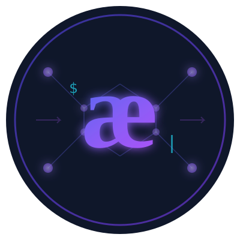
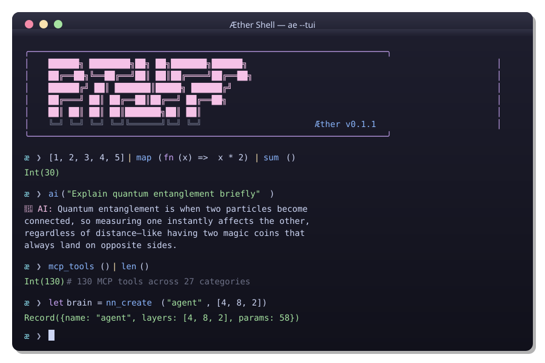

<p align="center">
  
</p>

<h1 align="center">Æther Shell (ae)</h1>

<p align="center">
  <a href="https://crates.io/crates/aether_shell"></a>
  <a href="https://github.com/nervosys/AetherShell/actions"></a>
  <a href="https://github.com/nervosys/AetherShell/blob/master/LICENSE"></a>
  <a href="https://github.com/nervosys/AetherShell/stargazers"></a>
</p>

<p align="center">
  <strong>The world's first agentic shell with typed functional pipelines and multi-modal AI.</strong><br>
  <em>Built in Rust for safety and performance, featuring revolutionary AI protocols found nowhere else.</em>
</p>

<p align="center">
  <a href="#-quick-start">Quick Start</a> •
  <a href="#-features">Features</a> •
  <a href="#-examples">Examples</a> •
  <a href="docs/TUI_GUIDE.md">TUI Guide</a> •
  <a href="#-documentation">Docs</a> •
  <a href="#-contributing">Contributing</a>
</p>

---

<p align="center">
  
</p>

---

## 🚀 Quick Start

### VS Code Extension (Syntax Highlighting + LSP)

For full IDE support including syntax highlighting, IntelliSense, and error diagnostics:

```bash
# Install the extension from marketplace
code --install-extension admercs.aethershell

# Build the Language Server (for IntelliSense)
cd AetherShell
cargo build -p aethershell-lsp --release

# The extension will auto-detect the LSP server
```

**Features:** Syntax highlighting, autocompletion, hover docs, go-to-definition, error diagnostics.

### Installation

```bash
# Install from source
git clone https://github.com/nervosys/AetherShell && cd AetherShell
cargo install --path . --bin ae

# Launch interactive TUI (recommended)
ae tui

# Or classic REPL
ae

# Run a script file
ae script.ae
```

```ae
# Typed pipelines — not text streams!
[1, 2, 3, 4, 5] | map(fn(x) => x * 2) | sum()
# => 30

# Pattern matching
match type_of(42) {
    "Int" => "It's an integer!",
    _ => "Something else"
}

# String manipulation
"hello,world" | split(",") | map(fn(s) => upper(s)) | join(" ")
# => "HELLO WORLD"

# AI query
ai("Explain quantum computing in simple terms")

# AI with vision
ai("Describe this image", {images: ["photo.jpg"]})

# AI agent with tool access
agent("Find all TODO comments in src/", ["ls", "cat", "grep"])

# 38 built-in themes
config_set("colors.theme", "dracula")
themes() | take(5)
# => ["catppuccin", "catppuccin-latte", "catppuccin-frappe", ...]
```

> **📝 Note:** Set `OPENAI_API_KEY` for AI features: `export OPENAI_API_KEY="sk-..."`

---

## ✨ Features

<table>
<tr>
<td width="50%">

### 🤖 AI-Native Shell
- **Multi-modal AI**: Images, audio, video analysis
- **Autonomous agents** with tool access
- **130+ MCP tools** across 27 categories
- **Multi-provider**: OpenAI, Ollama, local models
- **Fine-tuning API** for custom model training
- **RAG & Knowledge Graphs** built-in

</td>
<td width="50%">

### 💎 Typed Pipelines
- **Hindley-Milner** type inference
- **Structured data**: Records, Arrays, Tables
- **First-class functions** and lambdas
- **Pattern matching** expressions

</td>
</tr>
<tr>
<td width="50%">

### 🧠 ML & Enterprise
- **Neural networks** creation & evolution
- **Reinforcement learning** (Q-Learning, DQN)
- **Enterprise RBAC** with role-based access
- **Audit logging** & compliance reporting
- **SSO integration** (SAML, OAuth, OIDC)
- **Cluster management** for distributed AI

</td>
<td width="50%">

### 🎨 Developer Experience
- **Interactive TUI** with tabs & themes
- **Language Server Protocol** (LSP)
- **VS Code extension** with IntelliSense
- **Plugin system** with TOML manifests
- **WASM support** for browser REPL
- **Package management** & imports

</td>
</tr>
</table>

---

## 🎯 What Makes AetherShell Unique?

AetherShell is the **only shell** combining these capabilities:

| Feature                             | AetherShell | Traditional Shells | Nushell |
| ----------------------------------- | :---------: | :----------------: | :-----: |
| AI Agents with Tools                |      ✅      |         ❌          |    ❌    |
| Multi-modal AI (Vision/Audio/Video) |      ✅      |         ❌          |    ❌    |
| MCP Protocol (130+ tools)           |      ✅      |         ❌          |    ❌    |
| Neural Networks Built-in            |      ✅      |         ❌          |    ❌    |
| Hindley-Milner Types                |      ✅      |         ❌          |    ✅    |
| Typed Pipelines                     |      ✅      |         ❌          |    ✅    |
| Agent-to-Agent Protocol (A2A)       |      ✅      |         ❌          |    ❌    |
| Consensus Protocol (NANDA)          |      ✅      |         ❌          |    ❌    |
| Enterprise (RBAC, Audit, SSO)       |      ✅      |         ❌          |    ❌    |
| Language Server Protocol (LSP)      |      ✅      |         ❌          |    ✅    |

---

## 📐 Language Features at a Glance

AetherShell is a **typed functional language** with 215+ built-in functions across these categories:

<table>
<tr>
<td width="33%">

### Types & Literals
- `Int` — `42`, `-7`
- `Float` — `3.14`, `2.0`
- `String` — `"hello"`, `"${var}"`
- `Bool` — `true`, `false`
- `Null` — `null`
- `Array` — `[1, 2, 3]`
- `Record` — `{a: 1, b: 2}`
- `Lambda` — `fn(x) => x * 2`

</td>
<td width="33%">

### Operators
- Arithmetic: `+` `-` `*` `/` `%` `**`
- Comparison: `==` `!=` `<` `<=` `>` `>=`
- Logical: `&&` `||` `!`
- Pipeline: `|`
- Member: `.`

</td>
<td width="33%">

### Control Flow
- `match` expressions
- Pattern guards
- Wildcard `_` patterns
- Lambda functions
- Pipeline chaining

</td>
</tr>
</table>

### Builtin Categories (215+ functions)

| Category        | Examples                                                   | Count |
| --------------- | ---------------------------------------------------------- | ----- |
| **Core**        | `help`, `print`, `echo`, `debug`, `assert`, `trace`        | 15    |
| **Functional**  | `map`, `where`, `reduce`, `take`, `any`, `all`             | 12    |
| **String**      | `split`, `join`, `trim`, `upper`, `lower`, `replace`       | 10    |
| **Array**       | `flatten`, `reverse`, `slice`, `range`, `zip`, `push`      | 8     |
| **Math**        | `abs`, `min`, `max`, `sqrt`, `pow`, `floor`, `ceil`        | 8     |
| **Aggregate**   | `sum`, `avg`, `product`, `unique`, `values`                | 5     |
| **File System** | `ls`, `cat`, `pwd`, `cd`, `exists`, `mkdir`                | 11    |
| **Config**      | `config`, `config_get`, `config_set`, `themes`             | 7     |
| **AI**          | `ai`, `agent`, `swarm`, `rag_query`, `finetune_start`      | 20+   |
| **Enterprise**  | `role_create`, `audit_log`, `sso_init`, `compliance_check` | 22    |
| **Distributed** | `cluster_create`, `job_submit`, `aggregate_results`        | 15    |
| **Platform**    | `platform`, `is_windows`, `is_linux`, `features`           | 12    |

---

## 📖 Examples

### Core Syntax — Typed Functional Programming

```ae
# Literals and Types
let age = 42                    # Int
let pi = 3.14159                # Float
let name = "AetherShell"        # String
let active = true               # Bool
let empty = null                # Null

# String interpolation
let greeting = "Hello, ${name}! You're ${age} years old."

# Arrays — ordered collections
let nums = [1, 2, 3, 4, 5]
let mixed = [1, "hello", true, 3.14]

# Records — structured data
let user = {name: "Alice", age: 30, admin: true}
print(user.name)               # => "Alice"

# Lambdas — first-class functions
let double = fn(x) => x * 2
let add = fn(a, b) => a + b
print(double(21))              # => 42
print(add(10, 20))             # => 30
```

### Functional Pipelines — Structured Data Processing

```ae
# Transform arrays with map
[1, 2, 3] | map(fn(x) => x * x)        # => [1, 4, 9]

# Filter with where
[1, 2, 3, 4, 5] | where(fn(x) => x > 2) # => [3, 4, 5]

# Aggregate with reduce
[1, 2, 3, 4] | reduce(fn(a, b) => a + b, 0)  # => 10

# Chain operations for complex transformations
[1, 2, 3, 4, 5, 6, 7, 8, 9, 10]
  | where(fn(x) => x % 2 == 0)         # Keep evens
  | map(fn(x) => x ** 2)               # Square them
  | reduce(fn(a, b) => a + b, 0)       # Sum: 220

# Array manipulation
([1, 2, 3, 4, 5] | reverse)            # => [5, 4, 3, 2, 1]
([[1, 2], [3, 4]] | flatten)           # => [1, 2, 3, 4]
([1, 2, 3, 4, 5] | slice(1, 4))        # => [2, 3, 4]

# Check conditions
[1, 2, 3, 4, 5] | any(fn(x) => x > 4)  # => true
[2, 4, 6, 8] | all(fn(x) => x % 2 == 0) # => true
```

### Pattern Matching — Powerful Control Flow

```ae
# Match on values
let grade = fn(score) => match score {
    100 => "Perfect!",
    90..99 => "A",
    80..89 => "B",
    70..79 => "C",
    _ => "Keep trying"
}
print(grade(95))               # => "A"

# Match with guards
let classify = fn(n) => match n {
    x if x < 0 => "negative",
    0 => "zero",
    x if x > 0 => "positive"
}

# Match on types
let describe = fn(val) => match type_of(val) {
    "Int" => "An integer",
    "String" => "A string",
    "Array" => "An array with ${len(val)} elements",
    "Record" => "A record with keys: ${keys(val)}",
    _ => "Something else"
}
```

### String Operations — Built-in Text Processing

```ae
# Manipulation
split("a,b,c", ",")            # => ["a", "b", "c"]
join(["a", "b", "c"], "-")     # => "a-b-c"
trim("  hello  ")              # => "hello"
upper("hello")                 # => "HELLO"
lower("WORLD")                 # => "world"
replace("foo bar foo", "foo", "baz")  # => "baz bar baz"

# Queries
contains("hello world", "world")      # => true
starts_with("hello", "hel")           # => true
ends_with("hello", "lo")              # => true
len("hello")                          # => 5
```

### Math Operations — Scientific Computing

```ae
# Basic math
abs(-42)                       # => 42
min(5, 3)                      # => 3
max(5, 3)                      # => 5
pow(2, 10)                     # => 1024
sqrt(16)                       # => 4.0

# Rounding
floor(3.7)                     # => 3
ceil(3.2)                      # => 4
round(3.5)                     # => 4

# Statistical (on arrays)
sum([1, 2, 3, 4, 5])           # => 15
avg([10, 20, 30])              # => 20
product([2, 3, 4])             # => 24
unique([1, 2, 2, 3, 3, 3])     # => [1, 2, 3]
```

### File System — Structured Output

```ae
# List files with structured data
ls("./src")
  | where(fn(f) => f.size > 1000)
  | map(fn(f) => {name: f.name, kb: f.size / 1024})
  | take(5)

# Read and process files
cat("config.toml") | split("\n") | len()

# Check existence
exists("./src/main.rs")        # => true

# Get current directory
pwd()                          # => "/home/user/project"
```

### Configuration System — XDG-Compliant

```ae
# Get all config
config()

# Get specific values
config_get("colors.theme")           # => "tokyo-night"
config_get("history.max_size")       # => 10000

# Set values
config_set("colors.theme", "dracula")

# Get all paths (XDG-compliant)
let paths = config_path()
print(paths.config_file)       # ~/.config/aether/config.toml

# List all 38 built-in themes
themes()
# => ["catppuccin", "dracula", "github-dark", "monokai", 
#     "nord", "one-dark", "solarized", "tokyo-night", ...]
```

### AI Agents with Tool Access

```ae
# Deploy an AI agent that can use shell tools
agent("Analyze the project structure and find large files", ["ls", "cat", "wc"])

# Agent with configuration
agent({
  goal: "Find security issues in the codebase",
  tools: ["grep", "cat", "ls"],
  max_steps: 10,
  dry_run: true  # Preview actions first
})
```

### Multi-Modal AI

```ae
# Analyze images
ai("What's in this screenshot?", {images: ["screenshot.png"]})

# Process audio
ai("Transcribe and summarize this meeting", {audio: ["meeting.mp3"]})

# Video analysis
ai("Extract the key steps from this tutorial", {video: ["tutorial.mp4"]})
```

### Typed Functional Pipelines

```ae
# Structured data processing — not text parsing!
ls("./src")
  | where(fn(f) => f.ext == ".rs" && f.size > 1000)
  | map(fn(f) => {name: f.name, kb: f.size / 1024})
  | sort_by(fn(f) => f.kb, "desc")
  | take(5)

# Statistical operations
[1, 2, 3, 4, 5] | sum()      # => 15
[10, 20, 30] | avg()         # => 20.0
[1, 2, 1, 3] | unique()      # => [1, 2, 3]
{a: 1, b: 2} | values()      # => [1, 2]
```

### MCP Tools (Model Context Protocol)

```ae
# 130 tools across 27 categories
let tools = mcp_tools()
print(len(tools))  # => 130

# Filter by category
mcp_tools({category: "development"})     # git, cargo, npm, etc.
mcp_tools({category: "machinelearning"}) # ollama, tensorboard, etc.
mcp_tools({category: "kubernetes"})      # kubectl, helm, k9s, etc.

# Execute tools via MCP
mcp_call("git", {command: "status"})
```

### Neural Networks & Evolution

```ae
# Create a neural network
let brain = nn_create("agent", [4, 8, 2])

# Evolutionary optimization
let pop = population(100, {genome_size: 10})
let evolved = evolve(pop, fitness_fn, {generations: 50})

# Reinforcement learning
let agent = rl_agent("learner", 16, 4)
```

---

## 🌍 Real-World Use Cases

### DevOps: Log Analysis Pipeline

```ae
# Analyze logs with structured pipelines
cat("/var/log/app.log")
  | split("\n")
  | where(fn(line) => contains(line, "ERROR"))
  | map(fn(line) => {
      timestamp: line | slice(0, 19),
      message: line | slice(20, len(line))
    })
  | take(10)
```

### Data Science: CSV Processing

```ae
# Process CSV data functionally
let data = cat("sales.csv") | split("\n") | map(fn(row) => split(row, ","))
let headers = first(data)
let rows = data | slice(1, len(data))

# Calculate statistics
let totals = rows | map(fn(r) => r[2]) | map(fn(x) => x + 0) | sum()
print("Total sales: ${totals}")
```

### Security: Automated Code Audit

```ae
# AI-powered security scan
agent({
  goal: "Find potential security vulnerabilities in the codebase",
  tools: ["grep", "cat", "ls"],
  max_steps: 20
})

# Search for hardcoded secrets
ls("./src") 
  | where(fn(f) => ends_with(f.name, ".rs"))
  | map(fn(f) => {file: f.name, content: cat(f.path)})
  | where(fn(f) => contains(f.content, "password") || contains(f.content, "secret"))
```

### System Administration: Disk Usage Report

```ae
# Generate disk usage report
ls("/home")
  | map(fn(d) => {
      name: d.name,
      size_mb: d.size / (1024 * 1024),
      files: len(ls(d.path))
    })
  | where(fn(d) => d.size_mb > 100)
  | map(fn(d) => "${d.name}: ${round(d.size_mb)}MB (${d.files} files)")
```

### AI-Assisted Development

```ae
# Generate documentation with AI
let code = cat("src/main.rs")
ai("Generate comprehensive documentation for this Rust code:", {context: code})

# Code review assistant
agent({
  goal: "Review the recent changes and suggest improvements",
  tools: ["git", "cat", "grep"],
  max_steps: 15
})

# Generate tests
ai("Write unit tests for these functions:", {
  context: cat("src/utils.rs"),
  model: "openai:gpt-4o"
})
```

### Infrastructure: Kubernetes Monitoring

```ae
# List pods with structured output
mcp_call("kubectl", {command: "get pods -o json"})
  | map(fn(pod) => {
      name: pod.metadata.name,
      status: pod.status.phase,
      restarts: pod.status.containerStatuses[0].restartCount
    })
  | where(fn(p) => p.restarts > 0)
```

### Enterprise: RBAC & Compliance

```ae
# Create roles with permissions
role_create("data_analyst", [
    {resource: "reports", actions: ["read", "export"]},
    {resource: "dashboards", actions: ["read", "create"]}
], "Data analytics team role")

# Grant roles to users
role_grant("user_123", "data_analyst")

# Check permissions before operations
if check_permission("user_123", "reports", "export") {
    audit_log("report_export", {user: "user_123", report: "Q4_sales"})
    # ... export the report
}

# Compliance reporting
compliance_check("GDPR")
compliance_report("SOC2", "json")
```

### AI: Fine-tuning & RAG

```ae
# Start model fine-tuning
finetune_start("gpt-4o-mini", "training_data.jsonl", {
    epochs: 3,
    learning_rate: 0.0001
})

# Check fine-tuning status
finetune_status("ft-abc123")

# Build knowledge base with RAG
rag_index("project_docs", ["README.md", "docs/*.md"])
rag_query("project_docs", "How do I configure themes?")

# Knowledge graphs
kg_add("AetherShell", "language", "Rust")
kg_relate("AetherShell", "has_feature", "typed_pipelines")
kg_query({entity: "AetherShell"})
```

### Distributed Computing

```ae
# Create a compute cluster
cluster_create("ml_cluster", {max_nodes: 10})

# Add worker nodes
cluster_add_node("ml_cluster", "worker_1", {capabilities: ["gpu", "ml"]})
cluster_add_node("ml_cluster", "worker_2", {capabilities: ["gpu", "ml"]})

# Submit distributed jobs
job_submit("ml_cluster", "train_model", {
    model: "neural_net",
    data: "training_set.csv"
})

# Monitor cluster status
cluster_status("ml_cluster")
```

### Interactive Data Exploration

```ae
# Explore JSON APIs
let response = http_get("https://api.github.com/repos/nervosys/AetherShell")
print("Stars: ${response.stargazers_count}")
print("Forks: ${response.forks_count}")
print("Language: ${response.language}")

# Parse and transform
response.topics | map(fn(t) => upper(t)) | join(", ")
```

---

## 🎮 TUI Interface

Launch the beautiful terminal UI with `ae tui`:

| Tab        | Description                                |
| ---------- | ------------------------------------------ |
| **Chat**   | Conversational AI with multi-modal support |
| **Agents** | Deploy and monitor AI agent swarms         |
| **Media**  | View images, play audio, preview videos    |
| **Help**   | Quick reference and documentation          |

**Keyboard shortcuts:**
- `Tab` — Switch tabs
- `Enter` — Send message / activate
- `Space` — Select media files
- `q` — Quit
- `Ctrl+C` — Force quit

📖 **Full guide:** [docs/TUI_GUIDE.md](docs/TUI_GUIDE.md)

---

## 📦 Installation

### From Source (Recommended)

```bash
git clone https://github.com/nervosys/AetherShell
cd AetherShell
cargo install --path . --bin ae
```

### From Crates.io

```bash
cargo install aether_shell
```

### VS Code Extension

Get syntax highlighting, snippets, and integrated REPL:

```bash
cd editors/vscode
npm install && npm run compile
# Press F5 to test
```

---

## ⚙️ Configuration

### Environment Variables

```bash
# AI Provider (required for AI features)
export OPENAI_API_KEY="sk-..."

# Agent permissions
export AGENT_ALLOW_CMDS="ls,git,curl,python"

# Alternative AI backend
export AETHER_AI="ollama"  # or "openai"
```

### Secure Key Storage

```bash
# Store keys in OS credential manager (recommended)
ae keys store openai sk-your-key-here

# View stored keys (masked)
ae keys list
```

---

## 📚 Documentation

| Document                                             | Description               |
| ---------------------------------------------------- | ------------------------- |
| [Quick Reference](docs/QUICK_REFERENCE.md)           | One-page syntax guide     |
| [TUI Guide](docs/TUI_GUIDE.md)                       | Terminal UI documentation |
| [Type System](docs/TYPE_SYSTEM_GUIDE.md)             | Type inference details    |
| [MCP Servers](docs/MCP_SERVERS_GUIDE.md)             | Tool integration guide    |
| [AI Backends](docs/AI_BACKENDS.md)                   | Provider configuration    |
| [Security](docs/security/SECURITY_AUDIT_RED_TEAM.md) | Security assessment       |

### Example Scripts

| File                                                  | Topic            |
| ----------------------------------------------------- | ---------------- |
| [00_hello.ae](examples/00_hello.ae)                   | Basic syntax     |
| [01_pipelines.ae](examples/01_pipelines.ae)           | Typed pipelines  |
| [02_tables.ae](examples/02_tables.ae)                 | Table operations |
| [04_match.ae](examples/04_match.ae)                   | Pattern matching |
| [05_ai.ae](examples/05_ai.ae)                         | AI integration   |
| [06_agent.ae](examples/06_agent.ae)                   | Agent deployment |
| [09_tui_multimodal.ae](examples/09_tui_multimodal.ae) | Multi-modal TUI  |

### Coverage Test Scripts

| File                                                              | Topic               |
| ----------------------------------------------------------------- | ------------------- |
| [syntax_comprehensive.ae](tests/coverage/syntax_comprehensive.ae) | All AST constructs  |
| [builtins_core.ae](tests/coverage/builtins_core.ae)               | Core functions      |
| [builtins_functional.ae](tests/coverage/builtins_functional.ae)   | Functional ops      |
| [builtins_string.ae](tests/coverage/builtins_string.ae)           | String operations   |
| [builtins_array.ae](tests/coverage/builtins_array.ae)             | Array operations    |
| [builtins_math.ae](tests/coverage/builtins_math.ae)               | Math functions      |
| [builtins_aggregate.ae](tests/coverage/builtins_aggregate.ae)     | Aggregate functions |
| [builtins_config.ae](tests/coverage/builtins_config.ae)           | Config & themes     |

---

## 🧪 Testing

AetherShell has comprehensive test coverage with **100% pass rate**.

```bash
# Run the full test coverage suite
./scripts/test_coverage.ps1     # Windows PowerShell
./scripts/run_tests.sh          # Linux/macOS

# Run specific test categories
cargo test --test builtins_coverage  # 23 builtin tests
cargo test --test theme_coverage     # 6 theme tests
cargo test --test eval               # 6 evaluator tests
cargo test --test typecheck          # 10 type inference tests
cargo test --test pipeline           # Pipeline tests
cargo test --test smoke              # Smoke tests

# Run all library tests
cargo test --lib
```

### Test Coverage Summary

| Category             | Tests   | Status |
| -------------------- | ------- | ------ |
| Builtins Coverage    | 23      | ✅      |
| Theme System         | 6       | ✅      |
| Core Builtins        | 2       | ✅      |
| Evaluator            | 6       | ✅      |
| Pipelines            | 1       | ✅      |
| Type Inference       | 10      | ✅      |
| Smoke Tests          | 4       | ✅      |
| **.ae Syntax Tests** | 8 files | ✅      |

**Test files:** See [TESTING.md](TESTING.md) for the complete testing strategy and [tests/coverage/](tests/coverage/) for syntax coverage tests.

---

## 🛣️ Roadmap

See [ROADMAP.md](ROADMAP.md) for the complete development roadmap with detailed progress tracking.

### ✅ Completed (January 2026)
- 215+ builtins with comprehensive test coverage
- 38 built-in color themes with XDG-compliant config
- Neural network primitives & evolutionary algorithms
- 130+ MCP tools with protocol compliance
- Multi-modal AI (images, audio, video)
- Reinforcement learning (Q-Learning, DQN, Actor-Critic)
- Distributed agent swarms & cluster management
- Language Server Protocol (LSP) for IDE integration
- VS Code extension v0.2.0 with IntelliSense
- Enterprise features (RBAC, Audit, SSO, Compliance)
- Fine-tuning API for custom model training
- RAG & knowledge graphs
- Plugin system with TOML manifests
- WASM support (browser-based shell)
- Package management & module imports
- 100% test pass rate

### 🔜 Coming Soon
- Advanced video streaming
- Mobile platform support

---

## 🤝 Contributing

We welcome contributions! See our development setup:

```bash
git clone https://github.com/nervosys/AetherShell
cd AetherShell
cargo build
cargo test --lib
```

1. Fork the repository
2. Create a feature branch
3. Add tests for new functionality
4. Submit a pull request

---

## 📜 License

Licensed under the [Apache License 2.0](LICENSE).

---

<p align="center">
  <strong>Ready to experience the future of shell interaction?</strong><br><br>
  <code>ae tui</code>
</p>

<p align="center">
  <a href="https://github.com/nervosys/AetherShell">⭐ Star us on GitHub</a> •
  <a href="https://github.com/nervosys/AetherShell/issues">🐛 Report Issues</a> •
  <a href="https://github.com/nervosys/AetherShell/discussions">💬 Discussions</a>
</p>
