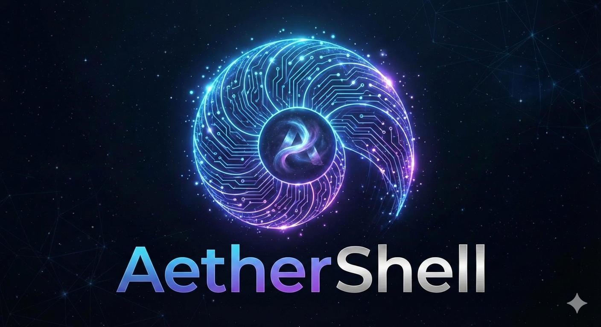

<p align="center">
  
</p>

<p align="center">
  <a href="https://github.com/nervosys/AetherShell/actions/workflows/ci.yml"></a>
  <a href="https://crates.io/crates/aethershell"></a>
  <a href="https://crates.io/crates/aethershell"></a>
  <a href="https://marketplace.visualstudio.com/items?itemName=admercs.aethershell"></a>
  <a href="https://github.com/nervosys/AetherShell/blob/master/LICENSE"></a>
  <a href="https://github.com/nervosys/AetherShell/stargazers"></a>
</p>

<h3 align="center">The shell for AI agents. Typed pipelines. Multi-modal. Protocol-native.</h3>

<p align="center">
  <a href="#-quick-start">Quick Start</a> •
  <a href="#-modules">Modules</a> •
  <a href="#-ai-agents">AI Agents</a> •
  <a href="#reliable-file-editing-for-llms">File Editing</a> •
  <a href="#shell-migration-transpilers">Migration</a> •
  <a href="#-protocols">Protocols</a> •
  <a href="#external-integrations">External Integrations</a> •
  <a href="#ai-context--discoverability">AI Context</a> •
  <a href="docs/TUI_GUIDE.md">TUI Guide</a>
</p>

---

## Quick Start

```bash
# Install
cargo install aethershell

# Or from source
git clone https://github.com/nervosys/AetherShell && cd AetherShell
cargo install --path . --bin ae

# Run
ae              # REPL
ae tui          # Interactive TUI
ae script.ae    # Run script
ae -c 'expr'    # Evaluate expression
ae --bash script.sh   # Transpile & run Bash
ae --zsh  script.zsh  # Transpile & run Zsh
ae --pwsh script.ps1  # Transpile & run PowerShell
ae script.sh          # Auto-detect by extension
```

```ae
# Typed pipelines, not text streams
ls("./src") | where(fn(f) => f.size > 1024) | take(5)

# Module system for clean APIs
file.exists("config.json")     # => {exists: true, is_file: true, ...}
sys.hostname()                 # => "my-machine"
crypto.uuid()                  # => "550e8400-e29b-41d4-a716-446655440000"

# AI with multi-modal support
ai("Explain this code", {context: file.read("main.rs")})
agent("Find bugs in src/", ["file.read", "grep"])
```

> Set `OPENAI_API_KEY` for AI features

---

## Language

```ae
# Types (inferred or explicit)
name = "AetherShell"                    # String
count = 42                              # Int
config: Record = {host: "localhost"}    # Explicit annotation

# Lambdas
double = fn(x) => x * 2
add = fn(a, b) => a + b

# Pipelines - typed data, not text
[1, 2, 3, 4, 5]
  | where(fn(x) => x > 2)               # [3, 4, 5]
  | map(fn(x) => x * 2)                 # [6, 8, 10]
  | reduce(fn(a, b) => a + b, 0)        # 24

# Pattern matching
grade = fn(score) => match {
    90..100 => "A",
    80..89 => "B",
    _ => "C"
}

# Error handling
result = try { risky() } catch e { default }

# String interpolation
greeting = "Hello, ${name}!"
```

---

## Modules

All 1,100+ builtins are organized into **106 namespaced modules**:

```ae
# File operations
file.read("config.toml")                    # Read file content
file.write("out.txt", "hello")              # Write => {success: true, bytes: 5}
file.exists("path")                         # Check => {exists: bool, is_file: bool, is_dir: bool}
file.copy("src", "dst")                     # Copy file or directory
file.move("old", "new")                     # Move/rename
file.backup("file.txt")                     # Create file.txt.bak
file.patch("file", 10, 20, "new content")   # Replace lines 10-20
file.mkdir("path/to/dir")                   # Create directories recursively

# System info
sys.hostname()                # => "my-machine"
sys.uptime()                  # => {days: 5, hours: 3, minutes: 42}
sys.cpu_info()                # => {cores: 8, model: "Apple M2", ...}
sys.mem_info()                # => {total: 16384, used: 8192, free: 8192}

# Network
net.interfaces()              # List network interfaces
net.ping("google.com")        # => {success: true, latency_ms: 12}
net.dns_lookup("github.com")  # => {ips: ["140.82.121.4"], ...}
http.get("https://api.github.com/users/octocat")

# Crypto
crypto.uuid()                              # Generate UUID
crypto.hash("sha256", "hello")             # => "2cf24dba5fb0a30e..."
crypto.jwt_decode(token)                   # Decode JWT

# Database
db.sqlite_open("app.db")                   # Open SQLite
db.sqlite_query(conn, "SELECT * FROM users")

# Platform detection & hardware info
platform.os()                 # => "windows" | "linux" | "macos"
platform.arch()               # => "x86_64" | "aarch64"
platform.cpu()                # => {name: "AMD Ryzen 9", cores: 12, logical_processors: 24, ...}
platform.memory()             # => {total_gb: 93.6, free_gb: 14.6, ...}
platform.disks()              # => [{mount: "C:", size_gb: 3725, free_gb: 256, ...}, ...]
platform.disk_usage("C:")     # => {total_bytes: 3999990280192, free_bytes: 275183259648, usage_percent: 93.1}
platform.gpus()               # => [{name: "NVIDIA RTX 4090", memory_mb: 24564}, ...]
platform.network_interfaces() # => [{name: "Ethernet", ip: "192.168.1.5", mac: "..."}, ...]
platform.hardware_summary()   # => {cpu: {...}, memory: {...}, disks: [...], gpus: [...], ...}

# Math and strings
math.sqrt(16)                 # => 4.0
math.pow(2, 10)               # => 1024
str.upper("hello")            # => "HELLO"
str.split("a,b,c", ",")       # => ["a", "b", "c"]

# Arrays
arr.range(5)                  # => [0, 1, 2, 3, 4]
arr.flatten([[1,2], [3,4]])   # => [1, 2, 3, 4]
arr.unique([1, 2, 2, 3])      # => [1, 2, 3]
```

**Core modules:** `file`, `sys`, `proc`, `fs`, `net`, `http`, `gui`, `web`, `crypto`, `db`, `svc`, `cron`, `archive`, `user`, `perm`, `pkg`, `hw`, `clip`, `input`, `ai`, `agent`, `math`, `str`, `arr`, `json`, `mcp`, `shell`, `platform`, `a2ui`, `a2a`, `nanda`, `rbac`, `audit`, `sso`, `cluster`, `nn`, `evo`, `rl` — and 68 more (see [AGENTS.md](AGENTS.md) for the full directory)

---

## 🤖 AI Coding Assistants

AI coding tools like **Claude Code**, **ChatGPT**, **Cursor**, **Windsurf**, and **VS Code Copilot** can leverage AetherShell for **reliable, cross-platform OS operations**.

### The Problem

When AI assistants need to perform system operations, they face platform fragmentation:

```bash
# Different commands per platform
ls -la                    # Linux/macOS
dir                       # Windows cmd
Get-ChildItem             # PowerShell

# Different escaping rules, encoding issues, error handling...
```

This forces AI tools to detect the OS, generate platform-specific commands, and handle edge cases—leading to errors and inconsistent behavior.

### The Solution: AetherShell as Universal Runtime

```ae
# Same command works everywhere: Windows, macOS, Linux
ls("./src")                              # => [{name, size, modified, ...}]
file.read("config.json")                 # => String content
file.write("output.txt", data)           # => {success: true, bytes: 42}
sys.hostname()                           # => "my-machine"
proc.list() | where(fn(p) => p.cpu > 10) # => High CPU processes
```

### Benefits for AI Coding Tools

| Capability            | Without AetherShell           | With AetherShell                 |
| --------------------- | ----------------------------- | -------------------------------- |
| **Cross-platform**    | Generate 3+ variants          | Single command                   |
| **File editing**      | Escape hell (`sed`, heredocs) | `file.replace()`, `file.patch()` |
| **Structured output** | Parse text with regex         | Native records/arrays            |
| **Error handling**    | Exit codes only               | `{success, error, details}`      |
| **Safe execution**    | Shell injection risks         | Typed parameters                 |
| **Batch operations**  | Script multiple commands      | Atomic operations                |

### Integration Example

An AI assistant can execute AetherShell commands directly:

```ae
# AI discovers system state
sys.cpu_info()           # => {cores: 8, model: "Apple M2"}
sys.mem_info()           # => {total: 16384, used: 8192}
net.interfaces()         # => [{name: "eth0", ip: "192.168.1.5", ...}]

# AI modifies files reliably (no escaping issues)
file.replace("src/config.rs",
    'const DEBUG: bool = false',
    'const DEBUG: bool = true')

# AI performs batch operations atomically
file.patch("Cargo.toml", [
    {find: 'version = "0.2.0"', replace: 'version = "0.3.0"'},
    {find: 'edition = "2018"', replace: 'edition = "2021"'}
])
# => {success: true, patches_applied: 2}

# AI creates complex pipelines
ls("./src") 
  | where(fn(f) => f.name | str.ends_with(".rs"))
  | map(fn(f) => {file: f.name, lines: file.read(f.path) | str.lines() | len()})
# => [{file: "main.rs", lines: 142}, ...]
```

### Tool Discovery

AI assistants can discover available operations:

```ae
mcp.tools()              # List all 130+ MCP-compatible tools
help("file")             # Documentation for file module
file                     # => {read, write, exists, copy, move, patch, ...}
```

This enables AI tools to understand what operations are available and use them correctly—without hardcoding platform-specific knowledge.

---

## AI Agents

```ae
# Simple query
ai("Explain recursion in one sentence")

# With context
ai("Summarize this file", {context: file.read("README.md")})

# Multi-modal (images, audio, video)
ai("What's in this image?", {images: ["photo.jpg"]})
ai("Transcribe this", {audio: ["meeting.mp3"]})

# Autonomous agent with tool access
agent("Find all TODOs in the codebase", ["file.read", "grep", "ls"])

# Agent with config
agent({
    goal: "Fix code style violations",
    tools: ["file.read", "file.write", "grep"],
    max_steps: 20,
    model: "openai:gpt-4o"
})

# Multi-agent swarm
swarm({
    coordinator: "Perform security audit",
    agents: [
        {role: "scanner", goal: "Find vulnerable deps"},
        {role: "reviewer", goal: "Check for injections"},
        {role: "reporter", goal: "Generate report"}
    ],
    tools: ["file.read", "grep", "http.get"]
})
```

---

## Reliable File Editing for LLMs

Traditional shells (Bash, PowerShell) make multi-line text operations error-prone for LLMs due to escaping, quoting, and command injection issues. AetherShell provides **structured file editing** that LLMs can use reliably:

### The Problem with Traditional Shells

```bash
# Bash: Fragile multi-line insertion - escaping nightmare
sed -i '10a\
line1\
line2' file.txt                          # Fails with quotes, backslashes, $vars

# PowerShell: Complex and error-prone  
$content = Get-Content file.txt          # Race conditions, encoding issues
```

### AetherShell: Structured, Reliable Operations

```ae
# Simple string replacement (handles any content)
file.replace("config.rs", 
    "const DEBUG: bool = false;",
    "const DEBUG: bool = true;")

# Multi-line insertion at specific position
file.insert("main.rs", {after: "use std::io;"}, "use std::fs;
use std::path::Path;
use std::collections::HashMap;")

# Insert at line number
file.insert("script.py", 10, "# This comment spans
# multiple lines without
# any escaping needed")

# Batch patches (atomic, all-or-nothing)
file.patch("config.toml", [
    {find: "debug = false", replace: "debug = true"},
    {find: 'log_level = "info"', replace: 'log_level = "debug"'},
    {find: "timeout = 30", replace: "timeout = 60"}
])
# => {success: true, patches_applied: 3, patches_failed: 0}

# Replace with multi-line content
file.replace("template.html",
    "<body></body>",
    "<body>
        <header>Welcome</header>
        <main id=\"content\">
            Loading...
        </main>
    </body>")
```

### Why This Matters for AI Agents

| Operation                     | Bash/PowerShell      | AetherShell                    |
| ----------------------------- | -------------------- | ------------------------------ |
| Multi-line insert             | ❌ Escape hell        | ✅ Native strings               |
| Special chars (`$`, `"`, `\`) | ❌ Breaks commands    | ✅ Just works                   |
| Atomic batch edits            | ❌ Manual rollback    | ✅ Built-in                     |
| Structured results            | ❌ Exit codes only    | ✅ `{success, applied, failed}` |
| Unicode/encoding              | ❌ Platform-dependent | ✅ UTF-8 always                 |

```ae
# AI agent can safely edit any file
agent({
    goal: "Add error handling to all functions",
    tools: ["file.read", "file.patch", "file.insert", "grep"],
    model: "openai:gpt-4o"
})
```

---

## Shell Migration (Transpilers)

AetherShell includes built-in transpilers for **Bash**, **Zsh**, and **PowerShell** — making adoption seamless. Run existing scripts directly or pipe shell code through `ae`:

```bash
# Run legacy scripts directly (auto-detected by extension)
ae deploy.sh              # Bash → AetherShell
ae setup.zsh              # Zsh  → AetherShell
ae provision.ps1          # PowerShell → AetherShell

# Explicit mode flags
ae --bash -c 'ls -la | grep .rs | wc -l'
ae --zsh  -c 'typeset -A config; config=(host localhost port 8080)'
ae --pwsh -c 'Get-ChildItem -Recurse | Where-Object {\$_.Length -gt 1MB}'

# Pipe shell code via stdin
echo 'for f in *.log; do wc -l \$f; done' | ae --bash
```

### What Gets Transpiled

| Shell Construct | AetherShell Output |
|---|---|
| `ls -la` | `ls("-la")` |
| `grep "pattern" file` | `str.grep("pattern", "file")` |
| `cat file.txt` | `file.read("file.txt")` |
| `X=42` | `let X = 42;` |
| `echo \$HOME` | `print(HOME);` |
| `cmd1 \| cmd2` | `cmd1() \| cmd2()` |
| Multi-line `if/for/while/case` | Single `sh([...])` block |
| `setopt`, `autoload`, `compdef` (Zsh) | `# (zsh-only: ...)` |
| `typeset -A arr` (Zsh) | `let arr = {};` |
| `Get-ChildItem` (PS) | `ls()` |
| `Write-Host` (PS) | `print()` |

The transpilers map **100+ commands** per shell to native AetherShell builtins, with block accumulation for multi-line constructs and fallback to `sh()` for anything unsupported.

---

## Protocols

AetherShell implements four agentic protocols:

### MCP (Model Context Protocol)
```ae
mcp.tools()                              # List 130+ tools
mcp.call("git", {command: "status"})     # Execute tool
mcp.connect("http://localhost:3001")     # Connect to server
```

### A2A (Agent-to-Agent)
```ae
a2a.send("analyzer", {task: "review", files: ls("./src")})
a2a.receive("analyzer")
```

### A2UI (Agent-to-User Interface)
```ae
a2ui.notify("Task complete", "success")
a2ui.progress("Processing", 0.75)
a2ui.confirm("Deploy to production?")
```

### NANDA (Consensus)
```ae
nanda.propose("deployment", {version: "2.0", threshold: 0.7})
nanda.vote("proposal_id", true)
```
---

## External Integrations

Connect AetherShell to external LLM providers and MCP tool servers.

### External LLMs

```ae
# Auto-detect best available backend
model = ai.detect()                      # => "ollama:llama3.2:3b"
ai.backends()                            # List all available providers

# OpenAI (set OPENAI_API_KEY)
ai("openai:gpt-4o", "Explain quantum computing")
ai("openai:gpt-4o-mini", "Summarize: ...")  # Cost-effective

# Anthropic Claude (set ANTHROPIC_API_KEY)
ai("anthropic:claude-3-opus", "Write detailed analysis")

# Local Ollama (free, private)
# Start: ollama serve && ollama pull llama3.2:3b
ai("ollama:llama3.2:3b", "Hello!")
ai("ollama:codellama:7b", "Write a function to...")

# vLLM (high-performance local)
ai("vllm:mistral-7b", "Generate code for...")

# Any OpenAI-compatible server (set COMPAT_API_BASE)
ai("compat:local-model", "Process this request")
```

### External MCP Tools (e.g., SiliconMonitor)

```ae
# List available MCP servers
mcp.servers()

# Connect to external MCP server (e.g., SiliconMonitor for hardware metrics)
# Start server first: silicon-monitor --mcp --port 3006
monitor = mcp.connect("http://localhost:3006")
print(monitor.available)                 # => true
print(monitor.tools)                     # => ["cpu_usage", "memory_info", ...]

# Create agent with external tool access
agent(
    "Monitor system health and alert on high CPU usage",
    ai.detect(),                         # Use best available LLM
    monitor.tools,                       # Give agent access to metrics
    5                                    # Max reasoning steps
)

# Connect multiple MCP servers
fs_server = mcp.connect("http://localhost:3001")      # Filesystem
git_server = mcp.connect("http://localhost:3002")     # Git operations
monitor = mcp.connect("http://localhost:3006")        # Hardware metrics

# Combine tools for powerful agents
all_tools = fs_server.tools + git_server.tools + monitor.tools
agent(
    "Analyze codebase performance impact on system resources",
    "openai:gpt-4o",
    all_tools,
    10
)

# Agent with MCP endpoint
agent.with_mcp("Check system health", monitor.tools, "http://localhost:3006")
```

### Environment Variables

| Variable            | Description                              |
| ------------------- | ---------------------------------------- |
| `OPENAI_API_KEY`    | OpenAI API key                           |
| `ANTHROPIC_API_KEY` | Anthropic Claude API key                 |
| `AETHER_AI`         | Default AI provider (`openai`, `ollama`) |
| `OLLAMA_HOST`       | Ollama server URL (default: localhost)   |
| `VLLM_API_BASE`     | vLLM server endpoint                     |
| `COMPAT_API_BASE`   | Custom OpenAI-compatible endpoint        |
| `AGENT_ALLOW_CMDS`  | Whitelist of allowed shell commands      |

### Advanced AI Features

```ae
# Streaming responses (OpenAI SSE, Anthropic SSE, Gemini SSE, Ollama NDJSON)
ai.chat_stream("openai:gpt-4o", "Explain quantum computing")

# Cost-based routing — automatically pick cheapest provider
ai.add_route({condition: "cost_under", max_cost_per_1k: 0.01, provider: "ollama"})

# Load balancing across providers (5 strategies)
ai_set_load_balancing("round_robin")       # Or: least_latency, weighted, adaptive, least_requests
ai_load_balancing()                        # Show current strategy

# Local inference — no API keys needed (compile with --features candle or --features onnx)
ai_local_backends()                        # List available backends
result = ai_local_load("models/llama.gguf")  # Load model into memory
ai_local_generate(result.handle, "Hello")  # Native Rust inference via Candle
ai_local_embed(result.handle, ["text"])    # Embeddings
ai_local_unload(result.handle)             # Free memory

# Usage & cost tracking
ai_usage()                                 # Token usage across providers
ai_cost()                                  # Cost breakdown by provider
ai_registry_stats()                        # Provider latency, success rate, p95
```

---

## Enterprise

```ae
# RBAC
rbac.create("admin", ["read", "write", "delete"])
rbac.grant("alice", "admin")
rbac.check("alice", "config.toml", "write")

# Audit logging
audit.log("file_modified", "config.toml", {user: "alice"})
audit.query({action: "file_modified", since: "2024-01-01"})

# SSO
sso.init("okta", {client_id: "...", issuer: "https://..."})
sso.auth(callback_data)
```

---

## ML Built-ins

```ae
# Neural networks
net = nn.create("policy", [8, 16, 4])
output = nn.forward(net, [0.1, 0.2, ...])

# Evolution
pop = evo.population(100, "nn", {layers: [4, 8, 2]})
pop = evo.evolve(pop, fitness_fn, 50)
best = evo.best(pop)

# Reinforcement learning
agent = rl.agent("q-learner", 16, 4, {epsilon: 0.1})
action = rl.action(agent, state)
agent = rl.update(agent, state, action, reward, next_state)
```

---

## Development

```bash
# Build
cargo build --release --bins

# Test
cargo test

# TUI
ae tui

# VS Code extension
code --install-extension admercs.aethershell
```

### Project Structure
```
src/
  main.rs          # Entry point
  eval.rs          # Expression evaluator
  parser.rs        # AetherShell syntax parser
  builtins.rs      # 1,100+ builtin functions
  modules.rs       # Module system (file, sys, net, ...)
  ai.rs            # AI provider integration
  agent.rs         # Autonomous agent framework
  tui/             # Terminal UI components
  transpile/       # Shell transpilers (Bash, Zsh, PowerShell)
```

---


## AI Context & Discoverability

AetherShell ships AI-readable metadata for discovery by Claude, ChatGPT, Copilot, and other AI assistants:

| File                                                                 | Standard                        | Purpose                                 |
| -------------------------------------------------------------------- | ------------------------------- | --------------------------------------- |
| [`llms.txt`](llms.txt)                                               | [llms.txt](https://llmstxt.org) | Short AI-readable summary               |
| [`llms-full.txt`](llms-full.txt)                                     | llms.txt                        | Complete context (syntax, modules, API) |
| [`AGENTS.md`](AGENTS.md)                                             | GitHub Copilot                  | Agent discovery with module directory   |
| [`.github/copilot-instructions.md`](.github/copilot-instructions.md) | GitHub Copilot                  | Development instructions                |
| [`.well-known/ai-plugin.json`](.well-known/ai-plugin.json)           | OpenAI                          | ChatGPT plugin manifest                 |
| [`.well-known/openapi.yaml`](.well-known/openapi.yaml)               | OpenAPI 3.1                     | Agent API specification                 |

---

## License

Dual-licensed under the [GNU Affero General Public License v3.0](LICENSE) (AGPL-3.0-or-later) for open source use, with a [commercial license](https://nervosys.ai) available for proprietary and enterprise use. All contributions require a [CLA](CLA.md). See [LICENSE](LICENSE) for details.

---

<p align="center">
  <strong>AetherShell</strong> - The OS interface for agentic AI<br>
  <a href="https://github.com/nervosys/AetherShell">GitHub</a> |
  <a href="https://crates.io/crates/aethershell">Crates.io</a> |
  <a href="https://discord.gg/aethershell">Discord</a>
</p>